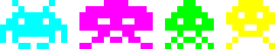
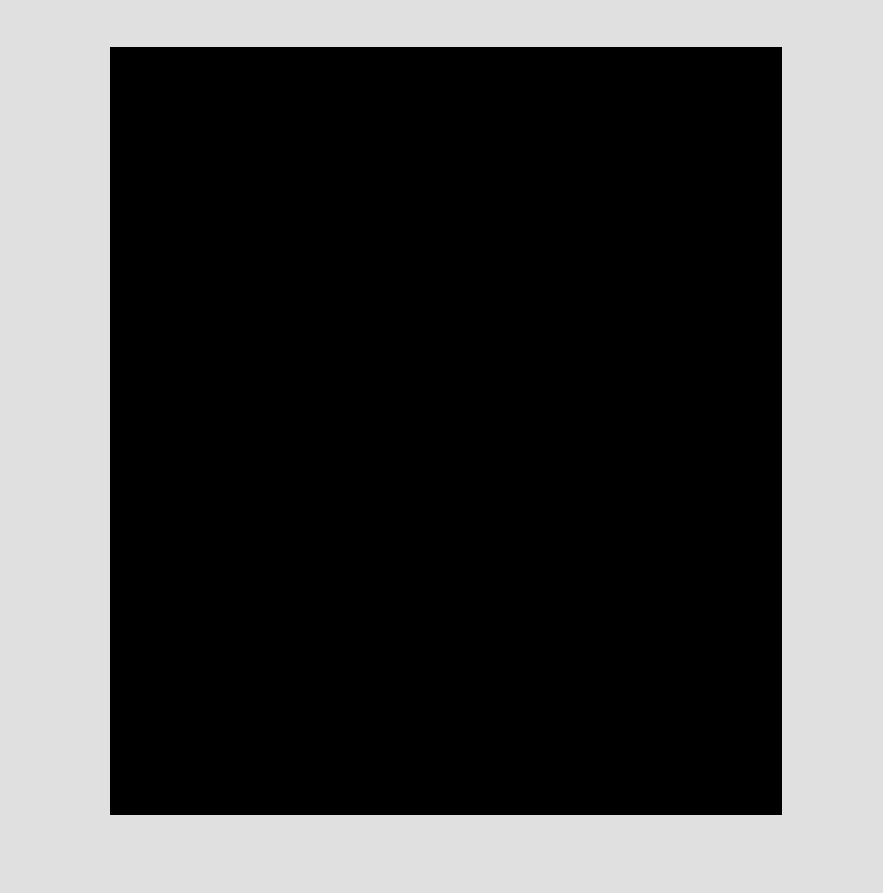

<p align="center">
  
</p>

# Space Invaders Part II ... Tribute :space_invader: :guitar:

Just a tribute to the best classic arcade :floppy_disk: :joystick: game in the world. One I wanted to make since I first started 
programming. So here it is...enjoy! :partying_face: 

<p align="center">
  
</p>

The goal of this project is to make an authentic clone of the original 1979 game complete with all features and a gameplay feel which is almost an exact match. The idea is to make a full clone which playable on a modern linux desktop.

## Project State

#### This project is currently undergoing a major refactor of the master branch and as such is in an unuseable state. However the archived version does compile and is playable (https://github.com/ianmurfinxyz/space_invaders_part_ii_archive). This project is being updated to use the newest version of my engine pixiretro and the play state is being refactored to be more authentic to the implementation of the original (documented here: http://computerarcheology.com/Arcade/SpaceInvaders/Code.html)

## Rendering

This is clone of the 1979 game space invaders part II implemented in C++ with a single file custom 
engine using SDL2 and Opengl 2.1 (because my computer is kinda old :persevere:). SDL2 is used 
for window management and to create the Opengl context whereas Opengl is used for all rendering.

The engine uses a somewhat novel approach to rendering (because I thought it would be fun, even
if not fast on modern hardware) in that all fonts and sprites are rendered as pure bitmap data using 
glBitmap and color is added by simply setting the draw color in the context. As a consequence 
all sprite assets and font glyphs are just arrays of 1s and 0s saved to files. 

To handle multiple screen resolutions the entire game world is scaled during initialisation
and all bitmaps are scaled to fit the world.

## Compilation and Dependencies

I have only tested this game on linux so it may not work on windows. The only libraries required 
to compile however are SDL2 and an Opengl implementation. On arch linux these can simply be
installed with,

```shell
$ pacman -S sdl2 mesa
```

then you can compile by running make,

```shell
$ make
```

random change
